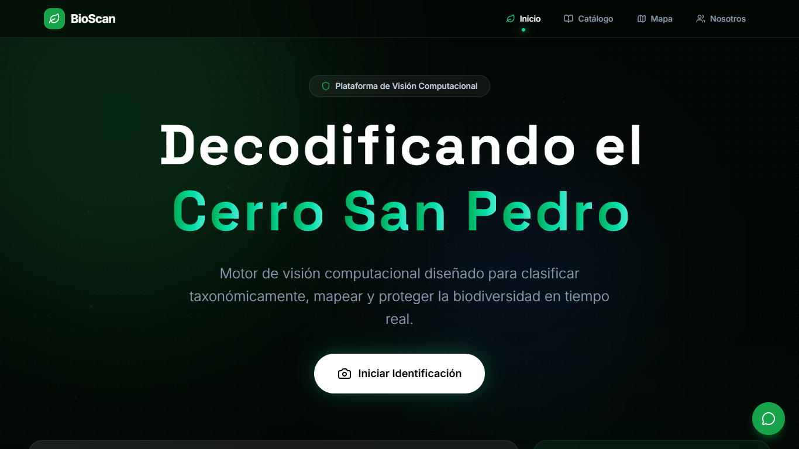
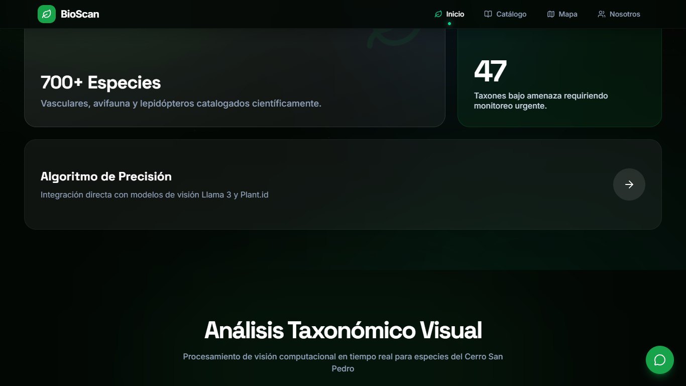
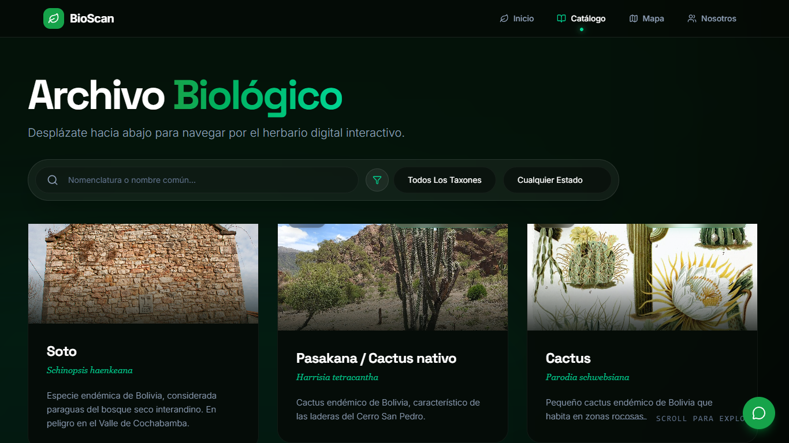
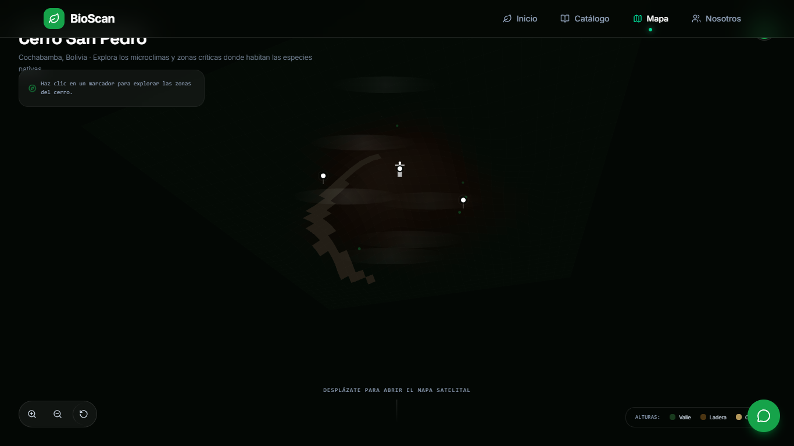
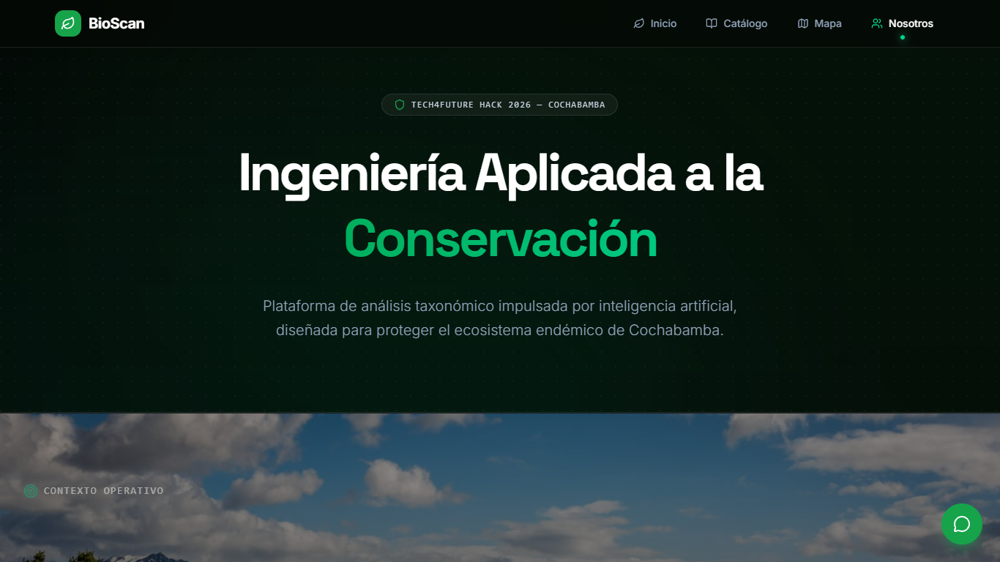

### INGENIERÍA EN SISTEMAS E INFORMÁTICA

## INFORME DE DESARROLLO FRONT-END

# DESARROLLO FRONT-END PARA BIOSCAN COCHABAMBA

Plataforma de ciencia ciudadana con IA para la identificación, geolocalización y monitoreo de la biodiversidad del Cerro San Pedro

### PROYECTO DE GRADO

**Dylan Stuwarth Camacho Bustamante**  
**Miguel Angel Zenteno Orellana**  
**Gabriel Esteban Hinojosa Quisbert**  
**Aron Jairo Arana Valdivia**  

**Docente:** Vladimir Wilmar Rojas Condori

Cochabamba - Bolivia  
2026

---

## 1. Descripción del prototipo desarrollado

BioScan Cochabamba es una plataforma web de tipo Single Page Application orientada a la ciencia ciudadana. Partimos de los mockups que hicimos en la Actividad 2 y los transformamos en una interfaz funcional e interactiva. La idea principal es que cualquier persona pueda sacar una foto de una planta o animal del Cerro San Pedro, subirla a la plataforma y obtener una identificación mediante inteligencia artificial. Además, las observaciones se geolocalizan automáticamente y se pueden ver en un mapa interactivo y en un catálogo taxonómico. Todo esto con animaciones fluidas y un diseño que se adapta tanto a computadoras como a celulares.

## 2. Capturas de las interfaces implementadas

A continuación se muestran las capturas de pantalla de la aplicación corriendo en el navegador:

**Pantalla de Inicio (Hero):**

**Módulo de Identificación con IA (Subida de foto):**

**Catálogo de Especies:**

**Mapa Interactivo:**

**Sección Nosotros (Scrollytelling):**

## 3. Navegación funcional entre páginas

La navegación se implementó con enrutamiento del lado del cliente (Client-Side Routing) usando React Router. Esto permite que al cambiar de sección la página no se recargue completamente, sino que solo se actualiza el contenido principal. El menú superior (Navbar) está presente en todas las páginas y da acceso directo a las cuatro secciones: Inicio, Catálogo, Mapa y Nosotros. Para que el usuario siempre sepa en qué sección está, incluimos un indicador visual (un punto verde luminoso) debajo del enlace activo. Desde la página de Inicio también se puede navegar directamente al módulo de identificación haciendo clic en el botón "Escanear Especie", que hace scroll suave hacia esa sección.

## 4. Recursos multimedia integrados

Para que la experiencia del usuario sea inmersiva y no se sienta como una página estática cualquiera, integramos lo siguiente:

- **Iconografía SVG:** Usamos la librería Lucide React para tener íconos vectoriales que no pierden calidad sin importar el tamaño de pantalla y que pesan muy poco.
- **Mapa interactivo:** Integramos Leaflet.js para mostrar un mapa real donde se pueden ver las ubicaciones de las especies identificadas. Se puede hacer zoom, mover el mapa y hacer clic en los marcadores.
- **Animaciones y micro-interacciones:** Implementamos un cursor personalizado bioluminiscente que reacciona cuando pasas por encima de botones o enlaces. También hay un efecto de escaneo tipo "láser" cuando subes una imagen, partículas flotantes en el fondo de la página principal, y transiciones suaves al cambiar de sección.
- **Scrollytelling:** En la sección de Nosotros implementamos una narrativa visual donde al hacer scroll se van cambiando las imágenes de fondo (cerro, incendios forestales, biodiversidad) de forma progresiva mientras aparece el texto explicando la problemática. Esto lo logramos con GSAP ScrollTrigger.
- **Imágenes de fondo optimizadas:** Las fotografías usadas en el scrollytelling están en resoluciones controladas y se aplican con CSS para que el navegador solo renderice lo necesario.

## 5. Tecnologías utilizadas

Para construir el Front-End elegimos herramientas modernas que nos permiten trabajar rápido y tener un resultado profesional:

- **HTML5 y CSS3:** Como base de estructura y estilos.
- **JavaScript (ES6+) y React:** React nos permitió trabajar con componentes reutilizables. Cada parte de la interfaz (el Navbar, las tarjetas de especies, el uploader, etc.) es un componente independiente.
- **Vite:** Lo usamos como empaquetador porque es mucho más rápido que Webpack. La recarga en desarrollo es prácticamente instantánea.
- **Tailwind CSS:** Framework de utilidades CSS que nos permitió estilizar todo de forma rápida manteniendo el diseño responsivo sin escribir hojas de estilo enormes.
- **Framer Motion:** Librería de animación para React. La usamos para las transiciones entre páginas, el menú móvil y los efectos de hover.
- **GSAP (GreenSock):** La usamos específicamente para el scrollytelling y el efecto de escaneo láser, porque tiene mejor rendimiento que CSS puro para animaciones complejas basadas en scroll.
- **Leaflet.js:** Librería de código abierto para el mapa interactivo.
- **React Router:** Para manejar las rutas y la navegación entre secciones sin recargar la página.

## 6. Dificultades encontradas y soluciones aplicadas

Durante el desarrollo nos topamos con algunos problemas técnicos que tuvimos que resolver sobre la marcha:

**1. El cursor personalizado tapaba el texto del menú**

Cuando implementamos el cursor personalizado con efecto de cristal (glassmorphism), nos dimos cuenta de que al pasar por encima del Navbar el efecto de desenfoque (`backdrop-filter: blur`) difuminaba las letras del menú, haciéndolas ilegibles. Parecía como si estuvieran censuradas. Para solucionarlo, cambiamos el comportamiento del cursor en estado hover: en vez del efecto de cristal, ahora se transforma en un anillo circular verde translúcido que resalta el enlace sin tapar nada.

**2. Las animaciones del scrollytelling no eran consistentes en distintas resoluciones**

El cambio de imágenes de fondo en la sección Nosotros se veía bien en pantallas grandes pero en resoluciones más chicas los textos se superponían o las transiciones saltaban. Lo resolvimos usando GSAP ScrollTrigger con posiciones calculadas dinámicamente en vez de valores fijos en píxeles. Así las transiciones dependen del porcentaje de scroll, no de medidas absolutas.

**3. Almacenamiento sin base de datos**

Como todavía no tenemos backend con base de datos para guardar las observaciones, necesitábamos alguna forma de que los datos persistieran al menos temporalmente. Optamos por usar el localStorage del navegador, pero las fotos originales pesaban demasiado y llenaban el espacio rápido (localStorage solo admite unos 5MB). Lo solucionamos creando una función que usa Canvas API para redimensionar la imagen a 400px de ancho y comprimirla en JPEG al 70% antes de guardarla, reduciendo drásticamente el peso.

## 7. Conclusiones

Logramos implementar todos los mockups de la Actividad 2 en una aplicación funcional. La plataforma corre sin problemas, la navegación entre secciones es fluida, y el diseño se adapta a diferentes tamaños de pantalla. Las animaciones le dan un toque profesional sin sacrificar rendimiento. Lo que más destaca es que no es solo una página informativa: el usuario puede interactuar subiendo fotos y obteniendo resultados en tiempo real. Para las siguientes etapas del proyecto, el plan es integrar una base de datos real en el backend y mejorar el modelo de identificación con más especies del Cerro San Pedro.

## 8. Bibliografía

Documentación de React. (s.f.). *React: Una biblioteca de JavaScript para construir interfaces de usuario.* Recuperado de https://es.reactjs.org/docs/getting-started.html

GreenSock. (s.f.). *GSAP ScrollTrigger Documentation.* Recuperado de https://greensock.com/docs/v3/Plugins/ScrollTrigger

Leaflet. (s.f.). *Leaflet: an open-source JavaScript library for mobile-friendly interactive maps.* Recuperado de https://leafletjs.com/

Tailwind Labs. (s.f.). *Tailwind CSS Documentation.* Recuperado de https://tailwindcss.com/docs

Framer. (s.f.). *Framer Motion Documentation.* Recuperado de https://www.framer.com/motion/

Vite. (s.f.). *Vite: Next Generation Frontend Tooling.* Recuperado de https://vitejs.dev/guide/
