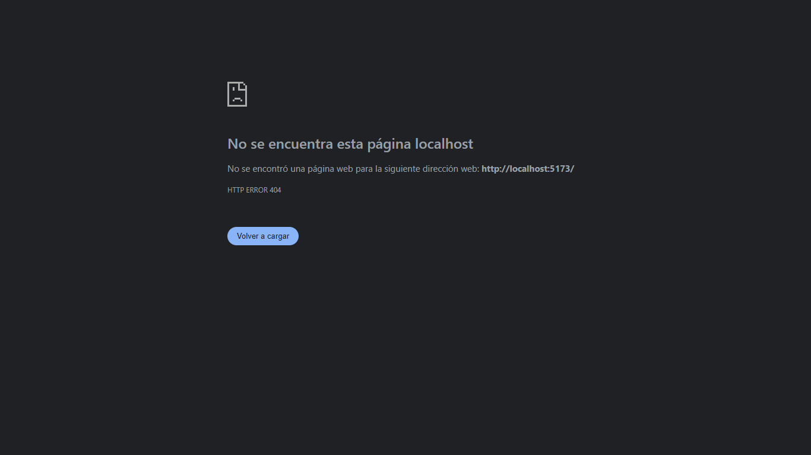
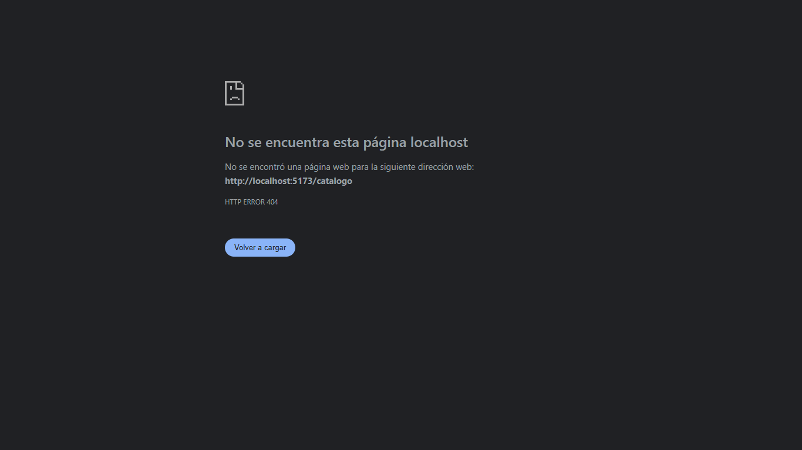
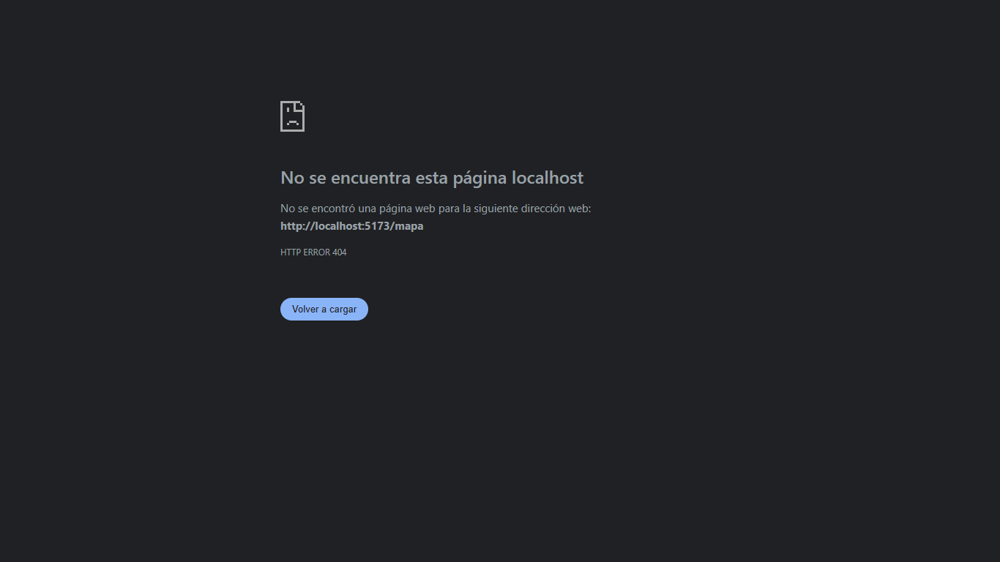

### INGENIERÍA EN SISTEMAS E INFORMÁTICA

## INFORME DE FUNCIONALIDADES DINÁMICAS (ACTIVIDAD 4)

# DESARROLLO FRONT-END AVANZADO: BIOSCAN COCHABAMBA

Plataforma de ciencia ciudadana con IA para la identificación, geolocalización y monitoreo de la biodiversidad del Cerro San Pedro

### PROYECTO DE GRADO

**Dylan Stuwarth Camacho Bustamante**  
**Miguel Angel Zenteno Orellana**  
**Gabriel Esteban Hinojosa Quisbert**  
**Aron Jairo Arana Valdivia**  

**Docente:** Vladimir Wilmar Rojas Condori

Cochabamba - Bolivia  
2026

---

## 1. Descripción de las funcionalidades implementadas

Como progresión a la estructura básica desarrollada en la fase anterior, en esta Actividad 4 se dotó a BioScan Cochabamba de interactividad y capacidades dinámicas mediante el uso intensivo de JavaScript. Las funcionalidades implementadas transforman la plataforma de un sitio informativo a una herramienta interactiva:
- **Gestor de carga de imágenes (Dropzone):** Un área interactiva que permite arrastrar y soltar fotografías, procesándolas en tiempo real.
- **Geolocalización automática:** Capacidad de detectar las coordenadas exactas del dispositivo al momento de registrar una observación.
- **Narrativa visual (Scrollytelling):** Sincronización de eventos de desplazamiento (scroll) con animaciones de fondo para explicar la problemática del Cerro San Pedro.
- **Notificaciones interactivas:** Sistema de alertas "Toast" no intrusivas que comunican el estado de las acciones (éxito, error, carga) al usuario.

## 2. Capturas de pantalla del sistema

*(Nota: Las imágenes muestran las funciones interactivas en acción)*

**Módulo de Escaneo y Validación Activa:**

**Animaciones basadas en Scroll (Nosotros) y Chatbot:**

**Catálogo con Filtros Dinámicos:**

**Mapa Integrado con Marcadores Interactivos (Leaflet):**

## 3. Recursos multimedia incorporados

Se incorporó un manejo multimedia avanzado más allá de imágenes estáticas:
- **Lienzos dinámicos (Canvas API):** Se utiliza procesamiento multimedia en memoria. Cuando el usuario sube una fotografía, el sistema usa JavaScript para dibujarla en un elemento `<canvas>` invisible, redimensionarla y comprimirla (reduciendo su peso en un 70%) antes de guardarla localmente.
- **Micro-interacciones y física de resortes:** Los botones y el cursor personalizado reaccionan con una física de animación tipo "resorte" (spring) que simula tensión y fricción, brindando una sensación táctil a la navegación.

## 4. APIs o librerías utilizadas

Para cumplir con los requerimientos de interacción y multimedia, se implementaron las siguientes librerías y APIs nativas:

1. **Geolocation API (API Web Nativa):** Se utilizó para solicitar permisos al usuario y extraer la latitud y longitud del dispositivo.
2. **GSAP (GreenSock Animation Platform) + ScrollTrigger:** Librería profesional de animación implementada para el efecto láser del escáner y el cambio dinámico de fondos en la sección "Nosotros".
3. **React Dropzone:** Librería de gestión de subida de archivos que facilita la interacción de "arrastrar y soltar".
4. **Framer Motion:** Utilizada para coordinar las transiciones fluidas de desmontaje y montaje entre páginas (Page Transitions).
5. **Leaflet.js y React-Leaflet:** Para el renderizado de la cartografía y marcadores interactivos georreferenciados.

## 5. Mejoras realizadas respecto a la Actividad 3

En la Actividad 3, el proyecto contaba con las interfaces maquetadas (HTML/CSS), navegación responsiva y la arquitectura de rutas. 
En esta Actividad 4, **la mejora fundamental es la operatividad del sistema**: 
- El área de subida de imágenes ya no es un componente estático, ahora lee archivos reales del sistema operativo. 
- Se pasó de un comportamiento de scroll tradicional a uno interceptado por GSAP. 
- Se implementó persistencia de datos temporal (localStorage) para que las fotos subidas y procesadas por el Canvas permanezcan en memoria durante la sesión del usuario.

## 6. Dificultades encontradas y soluciones aplicadas

1. **Saturación de memoria por peso multimedia:**
   - **Problema:** Al intentar guardar las imágenes originales subidas por los usuarios en el `localStorage`, el navegador colapsaba porque el límite de almacenamiento es de apenas 5MB.
   - **Solución:** Se implementó una rutina con la API Canvas de HTML5 que intercepta la imagen, genera una miniatura redimensionada a 400px y la comprime a JPEG, reduciendo el peso de la imagen a unos pocos kilobytes antes de almacenarla.

2. **Manejo asíncrono de la Geolocalización:**
   - **Problema:** La API de Geolocalización de HTML5 tarda varios segundos en responder o puede ser rechazada por el usuario, bloqueando la interfaz de guardado.
   - **Solución:** Se implementó manejo asíncrono con `Promises` y manejo de estados de carga (`loading states`). Si el usuario rechaza el permiso, el bloque `catch` permite que el sistema continúe funcionando asignando coordenadas por defecto del Cerro San Pedro, evitando que la aplicación se congele.

## 7. Conclusiones

La incorporación de APIs web nativas (Geolocalización, Canvas) y librerías externas (GSAP, Leaflet) ha elevado significativamente la calidad técnica del proyecto BioScan Cochabamba. El sistema ha superado la fase de maquetación estática, convirtiéndose en una aplicación web interactiva (Rich Internet Application). Las validaciones en cliente previenen errores comunes del usuario, y la optimización multimedia asegura un rendimiento fluido, cumpliendo plenamente con los objetivos de funcionalidad dinámica planteados en esta etapa.

## 8. Bibliografía (APA 7)

GreenSock. (s.f.). *GSAP ScrollTrigger Documentation.* Recuperado de https://greensock.com/docs/v3/Plugins/ScrollTrigger

Leaflet. (s.f.). *Leaflet: an open-source JavaScript library for mobile-friendly interactive maps.* Recuperado de https://leafletjs.com/

MDN Web Docs. (s.f.). *Geolocation API.* Recuperado de https://developer.mozilla.org/es/docs/Web/API/Geolocation_API

React Dropzone. (s.f.). *React Dropzone Documentation.* Recuperado de https://react-dropzone.js.org/
